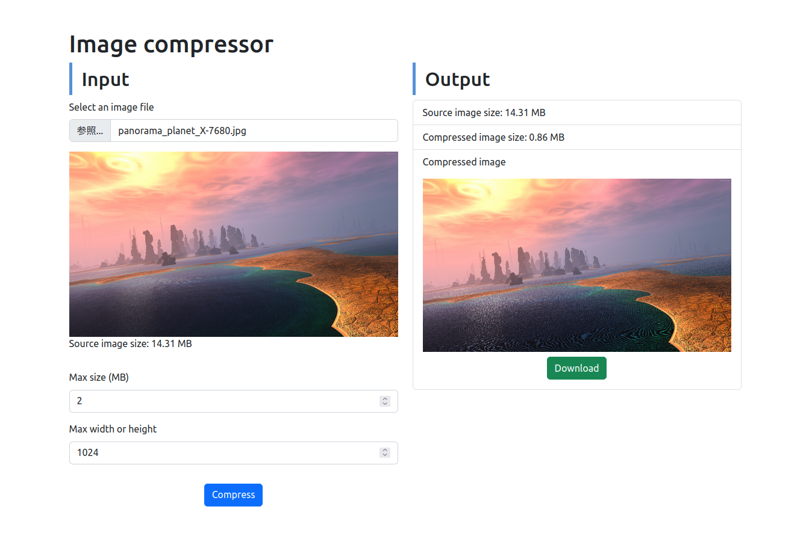

# Image compressor

A tool to compress images.

This is an output of my studing react.js

Thanks to [Browser Image Compression](https://github.com/Donaldcwl/browser-image-compression#readme)

## Gallery

## Usage

### Setup

- Clone this
- `yarn`
- `yarn build`
- `yarn preview`
- Go to `localhost:3000` on your browser

### App

Select an image file and click "Compress". Then you will see the output and download link :)

